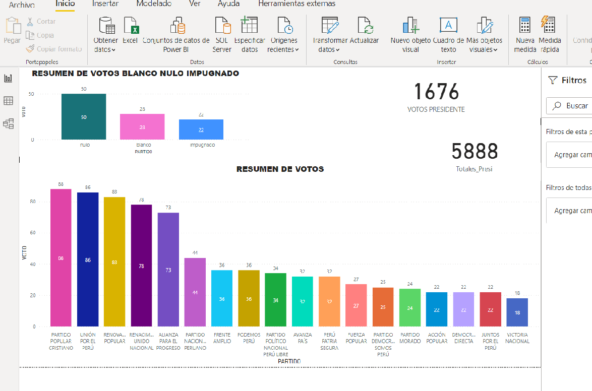
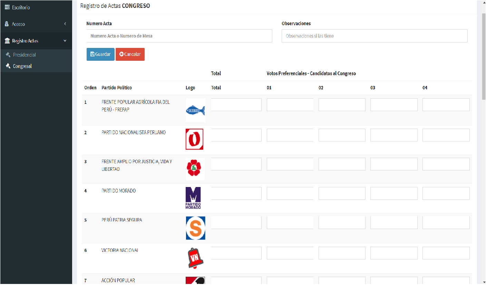

# Sistema de Registro de Actas de Escrutinio
## Elecciones 2021 - Peru (registro - Loreto)

---
*Registro de Actas*   **2021**    
Faltando exactamente una semana para las elecciones presidenciales y congresales en Perú, pongo el codigo libre en php, mysql, ajax, jscript, html, css, bootstrap, de este Sistema simple de registro de actas de escrutinio incluyendo la base de datos (usuario: admin, contraseña: admin)  

**Nota:** la parte estadistica la trabajo en Power BI, que estara en unos dias elaborado el reporte




Solo del Departamento de Loreto, no de todo el ~~Perú~~  
---
* Tipos de Actas
1. Presidencial
2. Congresal
3. ~~Parlamento Andino~~  que aun no esta implementado  

---
>Samo(Samuel Mori) [serviciosiquitos.com](http://serviciosiquitos.com "En Desarrollo") :telephone_receiver: 965 804357 :email: samorj1783@gmail.com  
---

Solo tendran que cambiar los datos del archivo **global.php** en (*registro_actas/config/global.php* )
  

```php
<?php 
//Ip de la pc servidor de base de datos
define("DB_HOST","localhost");

//Nombre de la base de datos
define("DB_NAME", "registro_actas");

//Usuario de la base de datos
define("DB_USERNAME", "root");

//Contraseña del usuario de la base de datos
define("DB_PASSWORD", "");

//definimos la codificación de los caracteres
define("DB_ENCODE","utf8");

//Definimos una constante como nombre del proyecto
define("PRO_NOMBRE","SAMO");
?>
```
***Pantallazos***  




**Tareas Culminadas**  :+1:

* [x] Inicio Sesion
* [x] Usuarios
* [x] Permisos
* [x] Registro Acta Presidencial
* [x] Registro Acta Congresal
* [x] Implementacion de Base de Datos(hasta este punto)


**Tareas Faltantes** :grimacing:

* [ ] Estadisticas
* [ ] Registro Acta Presidencial
* [ ] Implementacion de Base de Datos (del punto faltante)